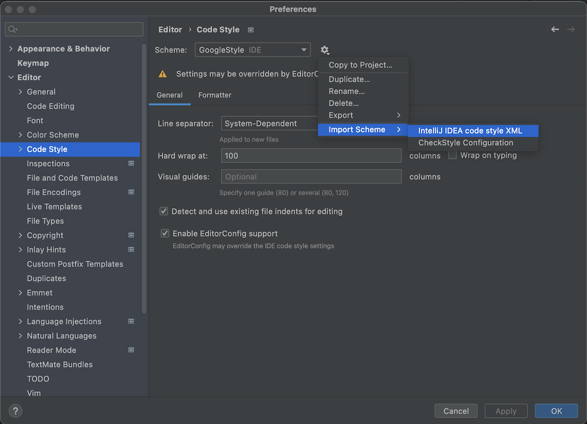

# Style Guide

- VSCode IDE:
  - Install these following VSCode extension:
    1. [Biome LSP VS Code Extension](https://marketplace.visualstudio.com/items?itemName=biomejs.biome)

- IntelliJ Ultimate IDE:
  - Install the following IntelliJ Ultimate plugin:
    1. [Biome plugin for Jetbrains IDEs](https://plugins.jetbrains.com/plugin/22761-biome)

- Zed IDE:
  - Install the following Zed extension:
    1. Open the Command Palette (View or Ctrl/⌘+⇧+P)
    2. Select zed: extensions
    3. Search Biome
    4. Select Install

```json
"editor.codeActionsOnSave": {
  "source.organizeImports": "explicit",
  "source.fixAll": "explicit"
}
```

- Use [EditorConfig](https://editorconfig.org/) for general coding styles.
  - Most Editors / IDEs support EditorConfig already.  
    [Download a plugin](https://editorconfig.org/#download) if your tool doesn't support it
    natively.
- Use [Spotless](https://github.com/diffplug/spotless)
  with [google-java-format](https://github.com/google/google-java-format) for Java source code.
  - Follow [Using the formatter](https://github.com/google/google-java-format#using-the-formatter)
    to set up formatter or plugin for your IDE.
    - :warning: For IntelliJ, download
      the [IntelliJ Java Google Style file](https://raw.githubusercontent.com/google/styleguide/gh-pages/intellij-java-google-style.xml)
      and import it into File→Settings→Editor→Code Style.  
      
